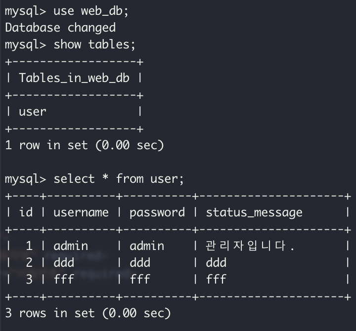

사용방법
```
brew install mysql
brew services start mysql
python3 -m venv venv
source venv/bin/activate
pip install flask flask_SQLAIchemy pymysql
flask run
```

프로그램 실행 후의 사진입니다. 


정상적으로 관리자 계정과 유저들이 생성된 것을 알 수 있습니다.


